# Spice World

[Visit the website here](https://msnirmal.github.io/Portfolio1/recipe.html) 

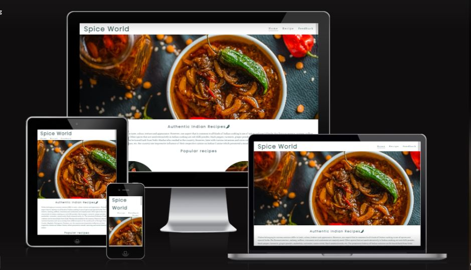

This website is created for food lovers, who are interested in Indian cuisine and targets people of all age group   

This website is made up of the following sections:

1.	Home
2.	Recipe
3.	Feedback form 

Business Goals :

1.	To advise users on how to prepare indian dishes 
2.	To encourage users to share their feedback/ tips, once they have tried the recipes posted,which could help in 
    continuous improvement and add more features/ recipes to the website 
3.	To also advise users to follow us on social media platforms for a wider reach, so that i could start my own brand of ready to eat supplies and spices 

User Goals:

1.	As a first-time visitor, I want a site that is simple and easy to use 
2.	As a first-time visitor, I want to easily navigate through the various sections 
3.	As a first-time visitor, I want to know the history of indian food
4.	As a first-time/ recurring visitor, I want to find clear and concise steps to ingredients and directions to prepare 
5.	As a first time/ recurring visitor, i want to try the recipes and share feedback 

## **UX**
---
### **Strategy**

To be in line with UX principles, first i thought  of a strategy to identify who the target users would be and what features they are looking for 

Spice World's target users are:
* Aged 15 & over 
* Food lovers 
* People with cooking as a hobby/ passion 

User requirements:
* Website that's simple and meets the purpose
* Ease of navigation  
* Clear and concise cooking instructions/ 
  ingredients 
* To be able to view on all devices 

### **Scope**

* Header with logo and navigation links to access various sections of the page 
* Brief history/ description section 
* Images of popular recipes 
* Recipe page with details of ingredients and  directions 
* Feedback page to capture comments and basic info like name and email address
* Social media links 

### **Structure**

This is a three page website that includes Home, Recipe and Feedback sections. The home page has navigation links at top right side and goes in the order Home > Recipe > feedback. The home page has a brief history on Indian food with images/ names of popular recipes and social media links as footer. Users can then find the ingredients and directions on Recipe page followed by a feedback section to share their comments 

### **Skeletal**

While creating a draft for this website and during the building process, i used different background colors, however, i felt the images that i have used will contrast well with a white background. Also, i have used divisions for ingredients and directions and bulleted them, so the user doesnt have to scroll a long page of contents and have a good experience 

### **Surface**

The overall background of this website is white, keeping in mind the colors of the images and fonts i have used, which are mostly shades of grey (partly black), that contrasts with the white background 

Used google fonts 'Poppins' and 'Vollkorn' for headings and body text respectively, considering the clarity and synchronization between them

## **Features**
---

This website is designed with an intent to share my family recipes with rest of the world, it is responsive and has eye catching images of food that would enagage the users to explore more. The website uses font Poppins for heading and Vollkorn for body text through out.  The website is simple and easy to use and meant for the purpose with no overwhelming information. 

### *Logo*

The logo is set as a link that brings back the user to 'Home' page directly from the other pages that they may be on  

### *Navigation*

The navigation links are at the top right side of the page, namely, Home, Recipe and Feedback and they are designed to be able to view on various screen sizes. The logo is also a link which when clicked, brings the user directly to the home 

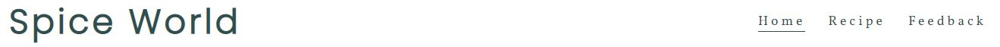

### *Home*

The Home page body is divided in to 3 sections. 

First section, is an animated hero image

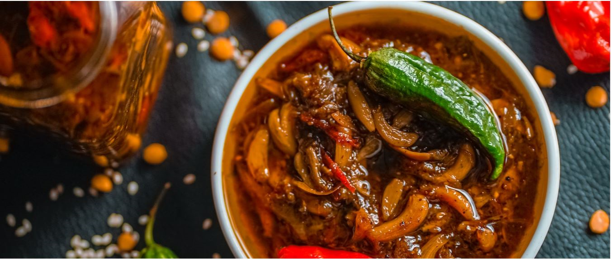

Second section, has a heading 'Authentic Indian Recipe' followed by a paragraph that describes the history of Indian food 

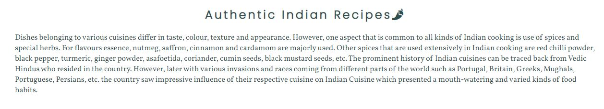

Third section, has details of two popular recipes 

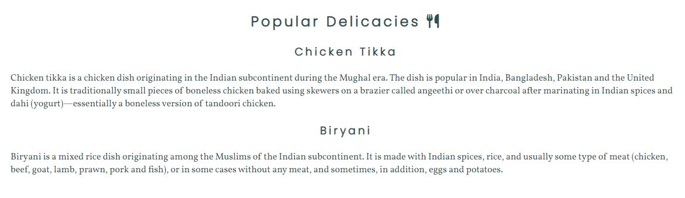

### *Recipe*

The Recipe page mirrors the Navigation bar from Home page and is divided in to 3 sections 

First section, has a different hero image to the Home page  

Second section has a heading of the first recipe- 'Chicken Tikka' followed by ingredients and directions one below the other 

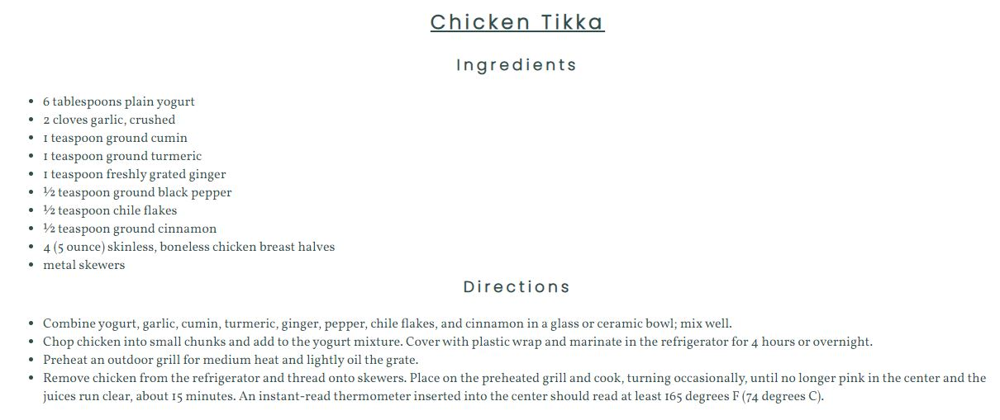

Third section has a heading of the second recipe- 'Biryani' followed by ingredients and directions one below the other

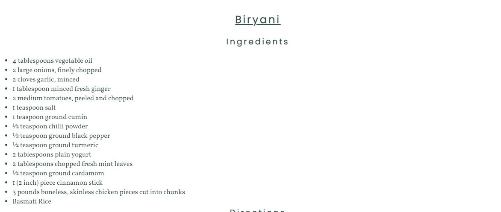
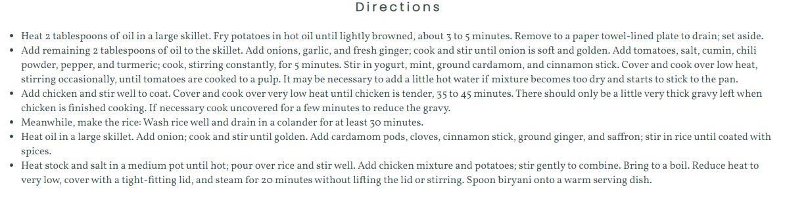

### *Feedback*

With an intent to capture customer reactions to the recipes, i have added the feedback section to know the level of acceptance, which can enable me in the decision making process of venturing to food business 

The feedback page mirrors the navigation bar of Home page and has 2 sections

First section, is a hero image that is animated (different to the home and recipe images) 

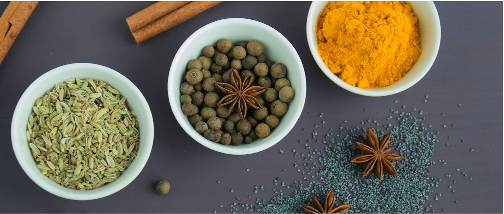

Second section is a form to capture basic details - Name, Email and Message

 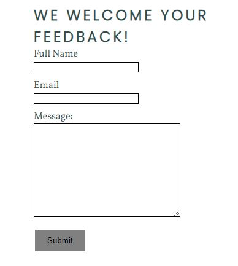

 ### *Footer*

 The footer includes icons of social media which when clicked would launch the respective social media sites like facebook, twitter, instagram and youtube

 

## Technologies Used 
---

The technologies i have used to create this website are as below-

- [HTML](https://developer.mozilla.org/en-US/docs/Web/HTML)
    - Used as the basic building block for the project and to structure the content.
- [CSS](https://developer.mozilla.org/en-US/docs/Learn/Getting_started_with_the_web/CSS_basics)
    - Used to style all the web content across the project. 
- [Google Fonts](https://fonts.google.com/)
    - Used to obtain the fonts linked in the header
- [Font Awesome](https://fontawesome.com/)
    - Used to obtain the social media icons used in the footer 
- [Google Developer Tools](https://developers.google.com/web/tools/chrome-devtools)
    - Used as a primary method of fixing spacing issues, finding bugs, and testing responsiveness across the project.
- [GitHub](https://github.com/)
    - Used to store code for the project after being pushed.
- [Gitpod](https://www.gitpod.io/)
    - Used as the development environment.

## Testing 
---

### *User Stories*

1. **As a first-time visitor, I want a site that is simple and easy to use**

   The page is made simple keeping in mind users of all age group. As soon as a user launches the page, they can see a brief introduction to Indian food in the body and the navigation bar at the top to access various sections (refer the page screenshot under features section of this document)

2. **As a first-time visitor, I want to easily navigate through the various sections**

   The User can easily view the navigation bar right at the top right hand side of the page, which when clicked would take them to respective sections (refer the page screenshot under features section of this document)

3. **As a first-time visitor, I want to know the history of indian food**

   The User can see this on the 'Home' page soon after launching the website on their computer systems (refer the page screenshot under features section of this document)

4. **As a first-time/ recurring visitor, I want to find clear and concise steps to ingredients and directions to prepare**

    The User when clicks on the recipe page would arrive at sections that has the name of dish followed by ingredients and directions to prepare (refer the page screenshot under features section of this document)

5. **As a first time/ recurring visitor, i want to try the recipes and share feedback**

   The User can reach  feedback page by clicking the 'Feedback' link in navigation bar at the top right hand side of the page. Once clicked the page has a form where they would need to input their name, email address, comment and submit (refer the page screenshot under features section of this document)

   While testing i came across that the website text was merging on smaller screens despite media queries. I have changed the layout of the content 

### *Bug fixes*

* During the building phase of this website i noticed responsive issues, which i have worked through to fix 

   ### **HTML and CSS Validation**
   ---

   I have validated both HTML codes for all 3 pages and CSS. i came across an error as below on all three  HTML files (index, recipe and feedback) with respect to hero image animation 

   *Forward is not a animation-fill-mode: forward; value*

   I have reviewed the code and corrected this 

   Screenshots below:

   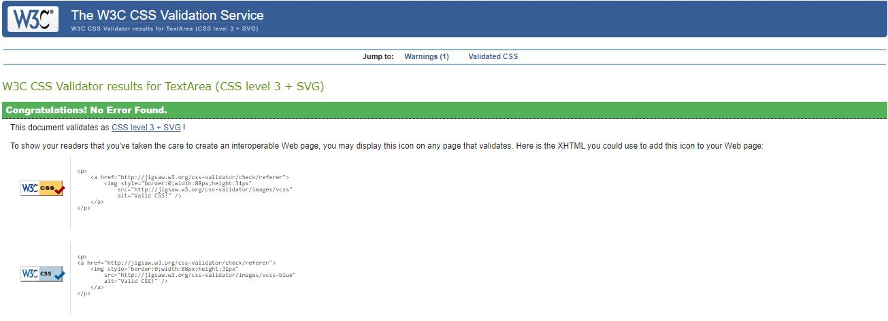
   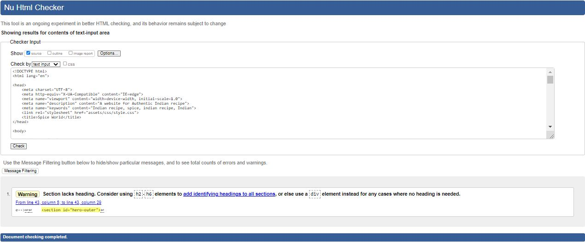
   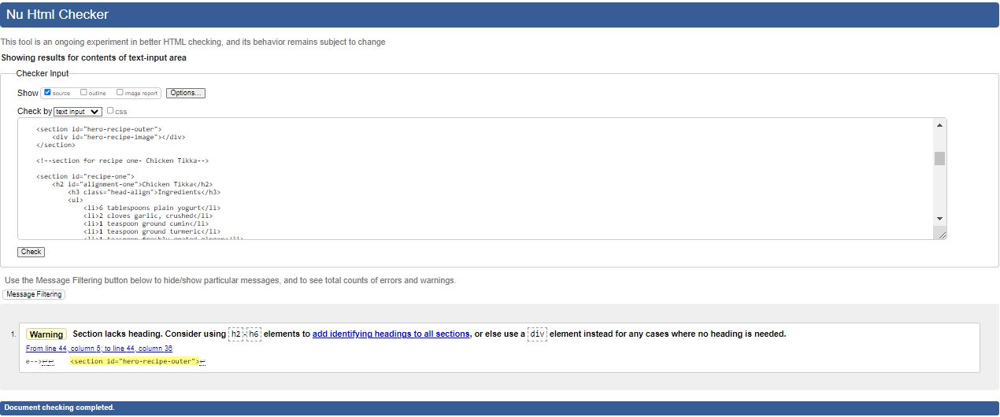
   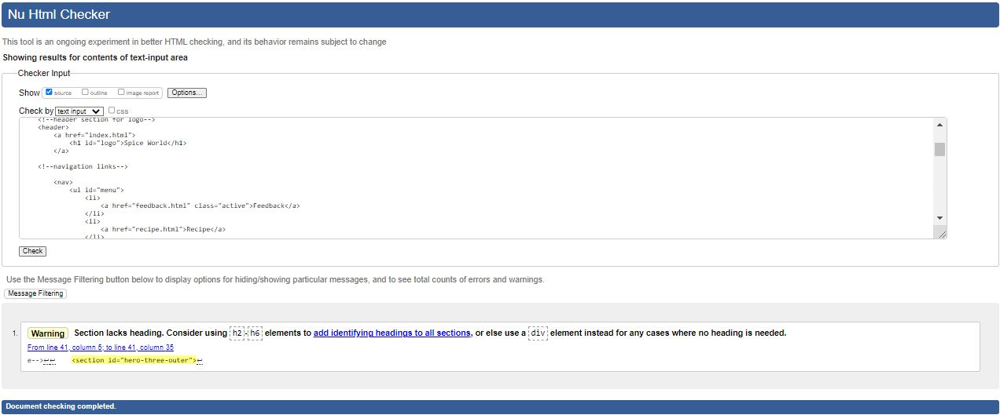

## Deployment
---

I deployed this website by using GitPages and following the below steps:

*GitHub pages deployment* 

1. Log in to GitHub
2. In your Repository section, select the project repository that you want to deploy
3. In the menu located at the top of this section, click 'Settings'
4. Select 'Git hub Pages' on the left-hand side menu
5. In the source section, select branch 'main' and save
6. The page then gives a URL, which in the case of this website is  https://msnirmal.github.io/Portfolio1/

## Credits 
---

I have taken ideas from my peers and their design during the intial phase of planning the structure. Apart from that i have followed the love running walk through project 

## Acknowledgements 
---

A big thanks to my mentor Harry Dhillon for the support and sharing some best practises 
   

